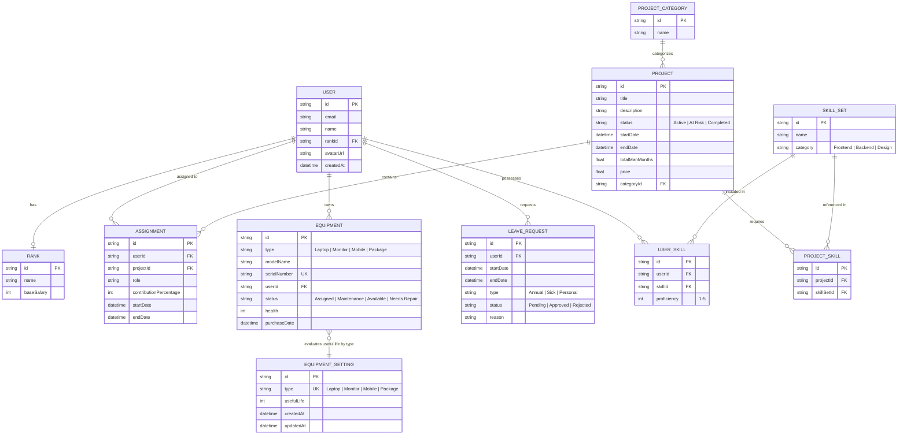

# Database ERD

이 프로젝트의 데이터베이스 엔티티 간 관계를 나타내는 ERD(Entity Relationship Diagram)입니다.

## 엔티티 상세 설명

- **USER**: 시스템 사용자 정보.
- **RANK**: 사용자의 직급 및 기본 단가 정보.
- **PROJECT**: 관리 대상 프로젝트 정보 및 상태 (총 투입 공수, 수주 가격, 카테고리 정보가 포함됨).
- **PROJECT_CATEGORY**: 프로젝트의 종류(DevOps, SI, Infra, Gateway 등) 마스터 데이터.
- **PROJECT_SKILL**: 프로젝트 실행에 요구되는 기술 스택(SKILL_SET)과 프로젝트 간의 매핑 테이블.
- **ASSIGNMENT**: 프로젝트에 투입된 인력 정보와 역할.
- **EQUIPMENT**: 사용자에게 할당된 자산(노트북, 모니터 등). 장비 구입일(`purchaseDate`)과 실시간 계산된 건강도(`health`) 정보를 가집니다.
- **EQUIPMENT_SETTING**: 장비 유형별 유효 수명(Useful Life, 개월수) 설정 데이터. 장비 건강도 계산의 기준 정보로 쓰입니다.
- **LEAVE_REQUEST**: 사용자의 휴가 신청 내역 및 결재 상태.
- **SKILL_SET**: 기술 스택 마스터 데이터.
- **USER_SKILL**: 사용자가 보유한 기술과 숙련도 정보.
