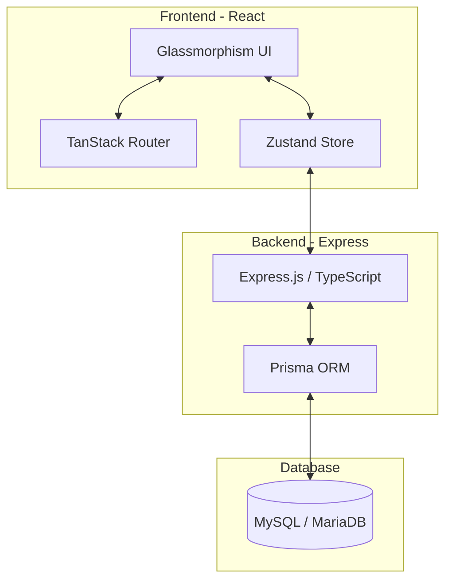
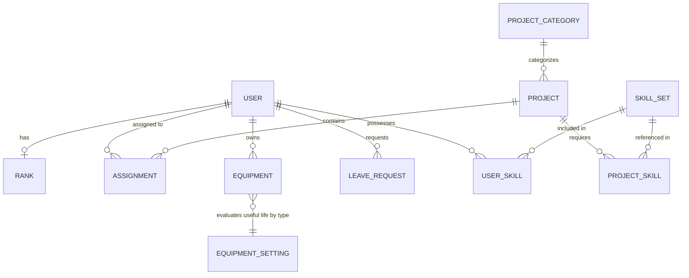

# 프로그램 통합 스펙 문서 (Program Specification)

본 문서는 현대적이고 직관적인 인터페이스를 갖춘 엔터프라이즈급 프로젝트 및 리소스 관리 시스템의 전체 기능 명세와 시스템 설계 구조를 통합하여 설명하는 종합 가이드라인입니다.

---

## 📌 1. 개요 (Overview)

### 1.1 시스템 목적
본 시스템은 기업 내 산재된 프로젝트 포트폴리오, 인적 자원(리소스), 캘린더/휴가 일정, 자산(장비)을 효율적으로 모니터링하고 최적화하기 위해 설계된 **엔터프라이즈급 통합 관리 플랫폼**입니다. 

### 1.2 비즈니스 가치
- **리소스 최적화**: 임직원의 기술 스택(Skill Set) 및 직급별 단가를 기반으로 프로젝트 투입 인력을 시각화하고 비용 효율을 극대화합니다.
- **실시간 프로젝트 모니터링**: 예산 집행율(Burn Rate) 및 프로젝트 상태를 실시간으로 추적하여 리스크를 선제적으로 방지합니다.
- **통합 관리**: 휴가 일정과 프로젝트 타임라인을 연동하여 리소스 공백을 신속히 파악하고 대응합니다.

---

## 🛠️ 2. 기술 스택 및 시스템 아키텍처

본 시스템은 프론트엔드와 백엔드가 명확히 분리된 **모노레포(Monorepo) 아키텍처**로 구성되어 있습니다.

### 2.1 상세 사양
- **프론트엔드 (Frontend)**:
  - **Framework**: React 18 (Vite 기반)
  - **Routing**: [TanStack Router](https://tanstack.com/router)를 통한 타입 안전(Type-safe) 라우팅
  - **State Management**: [Zustand](https://github.com/pmndrs/zustand)를 이용한 가볍고 직관적인 전역 상태 관리
  - **Styling**: Tailwind CSS v4를 활용한 프리미엄 다크 모드 및 Glassmorphism 테마 구현
  - **Data Visualization**: Chart.js / react-chartjs-2 기반의 실시간 데이터 대시보드
- **백엔드 (Backend)**:
  - **Runtime**: Node.js (TypeScript)
  - **Framework**: Express.js 기반의 RESTful API 설계
  - **ORM**: Prisma ORM을 통한 안전하고 기민한 데이터베이스 쿼리
- **데이터베이스 (Database)**:
  - **DBMS**: MySQL 또는 MariaDB 사용

> [!TIP]
> 세부적인 패키지 정보 및 실행 인프라 환경은 [기술 스택 상세 문서](./tech-stack.md) 및 [시작하기 가이드 문서](../guides/getting-started.md)를 참고하십시오.

---

## 🚀 3. 핵심 기능 명세 (Core Features)

본 시스템은 5가지의 핵심 기능 모듈로 구성됩니다.

### 3.1 프로젝트 포트폴리오 관리 (Project Portfolio)
- **실시간 상태 모니터링**: 프로젝트 진행 상황을 `Active`, `At Risk`, `Completed`의 3가지 상태로 구분하여 시각화합니다.
- **예산 집행율(Burn Rate) 추적**: 프로젝트 예산 대비 실제 투입 인력(공수)의 누적 비용을 실시간으로 계산하여 예산 소진 속도를 모니터링합니다.
- **마일스톤 및 활동 로그**: 핵심 일정 단계를 관리하고, 프로젝트에 발생한 중요 변경 내역을 기록합니다.

### 3.2 인력 및 리소스 관리 (Resource Management)
- **스킬 셋(Skill Set) 매핑**: 임직원의 기술 분야(Frontend, Backend, Design 등)와 숙련도(Proficiency, 1~5레벨)를 관리합니다.
- **비용 최적화**: 임직원의 직급(Rank)별 단가(baseSalary)와 프로젝트별 기여도(contributionPercentage)를 비교 분석하여 투입 비용 대비 효율성을 추적합니다.
- **인력 배정(Assignment)**: 인력을 유연하게 프로젝트에 할당하고 기간(startDate ~ endDate)을 제어합니다.

### 3.3 캘린더 및 휴가 관리 (Calendar & Leaves)
- **타임라인 시각화**: Gantt Chart 스타일의 타임라인 뷰를 제공하여 프로젝트 일정과 부재 일정을 한눈에 비교합니다.
- **휴가 신청 및 결재**: `Annual(연차)`, `Sick(병가)`, `Personal(개인 사유)` 등의 유형별 휴가를 신청하고 `Pending(대기)`, `Approved(승인)`, `Rejected(반려)` 상태를 거치는 워크플로우를 처리합니다.

### 3.4 자산/장비 관리 (Asset/Equipment Management)
- **장비 분류 및 매핑**: 개발용 노트북, 모니터, 모바일 기기 등의 장비 상태(`Assigned`, `Available`, `Maintenance`, `Needs Repair`)와 배정된 사용자를 관리합니다.
- **동적 건강도(Health) 평가**: 장비 유형별 유효 수명(Useful Life) 설정을 기준으로, 구매일(purchaseDate)로부터 경과된 시간을 계산하여 장비의 건강 지수를 100점 만점으로 자동 산출합니다.

### 3.5 대시보드 및 인사이트 (Dashboard & Insights)
- **KPI 시각화**: 활성 프로젝트 수, 평균 리소스 가동률, 전체 예산 대비 소진율 등의 성과 지표를 메인 대시보드에 노출합니다.
- **인사이트 제공**: 리소스가 부족하거나(At Risk) 예산 소진이 빠른 프로젝트를 조기에 경고합니다.

---

## 📊 4. 데이터베이스 구조 요약

시스템은 총 11개의 테이블로 유기적으로 연동되어 있으며, 그 관계는 다음과 같습니다.

### 4.1 핵심 엔티티
1. **USER**: 사원 기본 정보 및 프로필 데이터
2. **RANK**: 직급 정보 및 기본 급여 단가 (단가 최적화 계산용)
3. **PROJECT**: 프로젝트 제목, 상태, 예산 및 단가 정보
4. **ASSIGNMENT**: 특정 사원의 특정 프로젝트 기여도 및 배정 기간
5. **EQUIPMENT**: 장비의 모델명, 상태 및 건강도(Health) 데이터
6. **LEAVE_REQUEST**: 사원의 휴가 신청 유형 및 결재 상태

> [!TIP]
> 엔티티별 상세 속성 및 전체 스키마 명세는 [데이터베이스 ERD 문서](./database-erd.md) 및 [주요 API 엔드포인트 문서](./api-endpoints.md)를 참고하십시오.

---

## 🎨 5. UI/UX 디자인 사양 요약

본 플랫폼은 **미려하고 몰입도 높은 Dark-only 테마**를 지향하며, 엄격하게 규정된 디자인 규격에 따라 일관되게 개발됩니다.

### 5.1 색상 체계 (Color System)
- **배경 (Canvas)**: `#0A0A0A` (순수 다크 그레이)
- **요소 표면 (Surface 1 & 2)**: `#161616` 및 `#222222` (레이어 뎁스 구분을 위한 표면 색상)
- **강조 색상 (Accent Blue)**: `#0099FF` (하이퍼링크, 포커스 링, 선택 효과 전용이며 채우기 색상으로는 사용 불가)
- **경계선 (Hairline)**: `#2E2E2E` 및 `#242424` (매우 미세한 회색 테두리)

### 5.2 전역 레이어 스택 (z-index)
컴포넌트 간의 겹침 현상을 방지하기 위해 엄격한 스태킹 계층 구조를 따릅니다.

| 레이어 이름 | z-index 토큰 | 사용처 |
| :--- | :--- | :--- |
| **Sticky Header** | `z-[10]` | 테이블 및 타임라인 내 열 헤더 고정 |
| **Global Sidebar** | `z-[20]` | 메인 사이드바 내비게이션 |
| **Global Header** | `z-[30]` | 메인 상단 헤더 |
| **Dropdown / Popover** | `z-[40]` / `z-[45]` | 선택 창 드롭다운 및 툴팁/안내 팝업 |
| **Calendar Picker** | `z-[50]` | 일정/기간 선택용 캘린더 레이어 |
| **Base Modal** | `z-[100]` | 모달 팝업 및 어두운 배경 오버레이 |

> [!WARNING]
> 인라인 하드코딩된 임의의 z-index(예: `z-50`, `z-40` 등) 사용은 전면 금지되며, 반드시 상기 정의된 규격을 사용해야 합니다. 자세한 UI/UX 사양 및 컴포넌트 구현 지침은 [디자인 시스템 가이드](./design.md) 및 [프론트엔드 코드 컨벤션](../guides/frontend-conventions.md)을 참고하십시오.

---

## 🔗 6. 관련 상세 문서 내비게이션

보다 세부적인 개발 컨벤션 및 기술 명세는 아래의 문서 링크를 참조하시기 바랍니다.

- **설치 및 구동**: [시작하기 (Getting Started)](../guides/getting-started.md)
- **기술 상세 사양**: [기술 스택 (Tech Stack)](./tech-stack.md)
- **코딩 가이드라인**: [프론트엔드 컨벤션](../guides/frontend-conventions.md) | [백엔드 컨벤션](../guides/backend-conventions.md)
- **네이밍 가이드**: [명명 규칙 (Naming Conventions)](../guides/naming-conventions.md)
- **DB & API 명세**: [데이터베이스 ERD](./database-erd.md) | [주요 API 엔드포인트](./api-endpoints.md)
